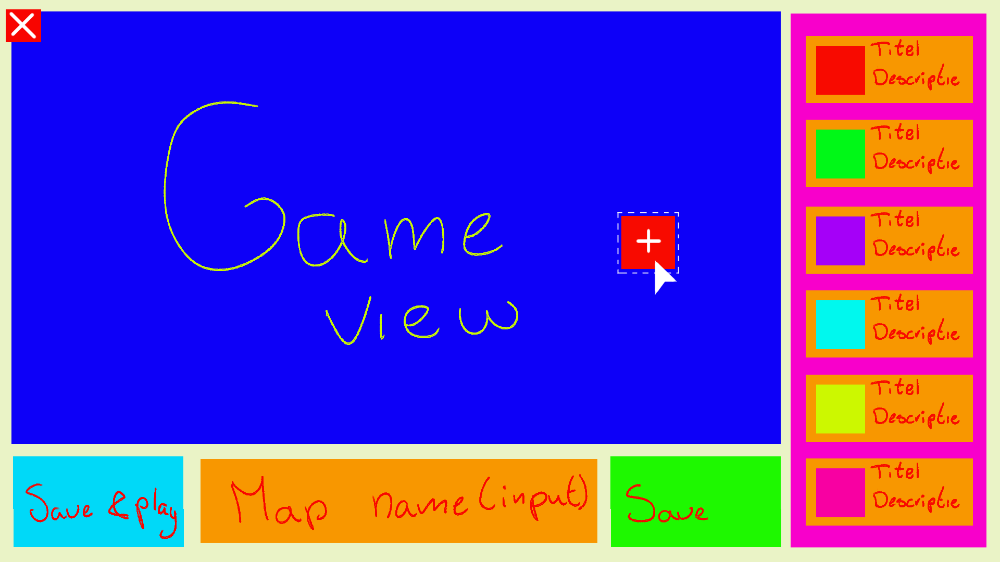
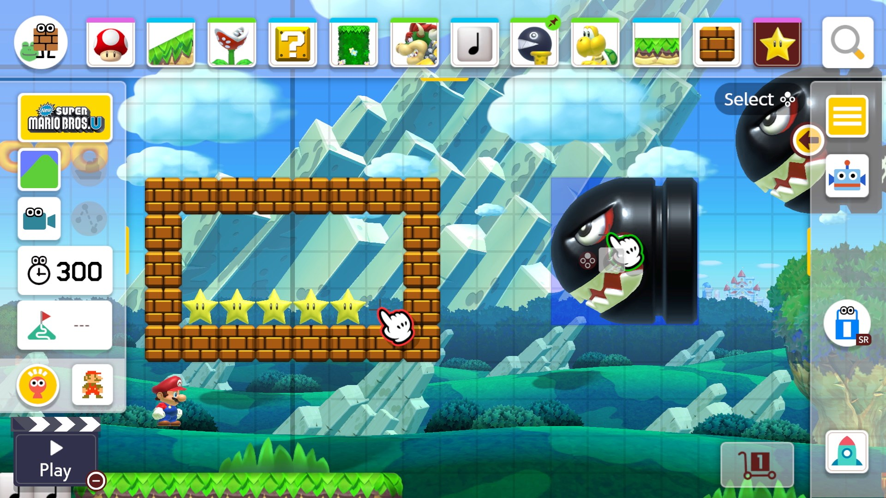

# Game Design Document — Level Builder
---

## 1. Overzicht

| Veld             | Invullen                                      |
| ---------------- | --------------------------------------------- |
| **Feature Naam** | _Level builder_                               |
| **Auteur**       | _Penny de boer & Marcos vinicius Martins Carvalho_                       |
| **Datum**        | _18-2-2026_                                   |
| **Versie**       | _1.0_                                         |
| **Branch**       | `Feature/LevelBuilder`                        |
| **Status**       | **📝 Concept** / ~~🔨 In ontwikkeling~~ / ~~✅ Afgerond~~|

---

## 2. User Story

> Als **player** wil ik **[een level builder]** zodat **[ik vrijheid heb om eigen levels te maken en die te spelen]**.

---

## 3. Beschrijving

_Met deze feature kan je levels bouwen en je ervaring meer uniek maken, Je maakt een level en het slaat op in de backend zodat je die later terug kan vinden bij de levels_

---

## 4. Gameplay Impact

### 4.1 Kernmechanisme

_De speler experimenteerd met levels bouwen en kan ze ook spelen_

### 4.2 Relatie met bestaande systemen


| Bestaand Systeem   | Relatie / Impact               |
| ------------------ | ------------------------------ |
| Score              | _geen relatie_                 |
| Combo / Multiplier | _geen relatie_                 |
| Lives              | _geen relatie_                 |
| Input              | _Je kunt eigen levels maken met een apart input systeem_                 |
| Level saving    | _Je kan de levels opslaan en later weer spelen_                            |

### 4.3 Game Feel

_Welke feedback krijgt de speler? Denk aan: screenshake, geluid, visuele effecten, UI-updates, animaties._

| Feedback Type | Beschrijving                       |
| ------------- | ---------------------------------- |
| Visueel       | _Overlay die je een "Builder" gevoel geeft_ |
| Audio         | _geluiden bij het plaatsen_            |
| Screenshake   | _geen_  |
| UI            | _een lijst met alle bumpers die je kan plaatsen en een knoppen waarbij je het kan opslaan/spelen_    |
| Animatie      | _builder overlay heeft miniscule animatie_        |

---

## 5. Regels & Parameters

_Definieer de concrete spelregels en instelbare waarden voor deze feature._

| Parameter            | Waarde  | Beschrijving                    |
| -------------------- | ------- | ------------------------------- |
| _Hoeveelheid bumpers_     | _gebaseerd op score? of gedefineerd nummer_ | _zodat je niet 1 miljoen bumpers tegenlijk hebt_  |

---

## 6. Visueel Ontwerp
### Schetsen / Referenties

> 


### Placeholder Art Beschrijving

_Borders van bumpers_

---

## 7. Audio Ontwerp

_Welke geluiden zijn nodig? Beschrijf per geluid het gewenste karakter._

| Geluid               | Beschrijving / Karakter            | Placeholder  |
| -------------------- | ---------------------------------- | ------------ |
| _Placing van bumpers sfx_ | _bloop_          | ☐ Ja / [x] Nee |
| _Fout placing van bumpers sfx_ | _beep_          | ☐ Ja / [x] Nee |
| _evt. "builder" muziek_     | _???_ | ☐ Ja / [x] Nee |

---

## 8. Technische Overwegingen

### 8.1 Architectuurlaag


```
┌─────────────────────────────────────┐
│   Feedback Layer                    │  [x]
│   (UI, Visuals, Sound)              │
├─────────────────────────────────────┤
│   Game Logic Layer                  │  ☐
│   (Scoring, Lives, Combos)          │
├─────────────────────────────────────┤
│   Interaction Layer                 │  [x]
│   (Bumpers, Ball Physics)           │
├─────────────────────────────────────┤
│   Input & Control Layer             │  [x]
│   (Crosshair, Aim, Shoot)           │
└─────────────────────────────────────┘
```

### 8.2 Benodigde Events

_Welke nieuwe events worden aangemaakt? Op welke bestaande events wordt geabonneerd?_

| Event                        | Richting        | Beschrijving                  |
| ---------------------------- | --------------- | ----------------------------- |
| _`onBumperPlaced`_ | Publish (nieuw) | _Fired bij bumper geplaatst_ |
| _`onBumperPlacedWrong`_ | Publish (nieuw) | _Fired bij bumper verkeerd geplaatst_ |
| _`onSaved`_ | Publish (nieuw) | _Fired bij save button geplaatst_ |

### 8.3 Benodigde Scripts / Componenten

| Script / Component   | Verantwoordelijkheid                   |
| -------------------- | -------------------------------------- |
| _DragAndDropSystem.cs_   | _zorgen dat je bumpers kan plaatsen_ |
| _PlaceBumpers.cs_   | _bumpers plaatsen op de toegewijsde plekken_ |
| _BuilderUI.cs_ | _de interacties van UI coderen_      |
| _SaveLayout.cs_ | _map data sturen naar json file_      |
| _SavedMap.json_ | _map data opslaan_      |

### 8.4 Uitschakelbaar

_De scene en knop naar scene kunnen uit de delen in scene kunnen uit maar dan kan je geen level meer bouwen_

---

## 9. Todo Lijst


- [ ] Game design document invullen en reviewen
- [ ] Placeholder art maken / verzamelen
- [ ] Script(s) aanmaken en implementeren
- [ ] UI elementen toevoegen
- [ ] Feature testen op bugs
- [ ] Usertest uitvoeren (min. 3 spelers)
- [ ] Usertest documentatie schrijven (`Usertest_LevelBuilder.md`)
- [ ] Technisch design document updaten
- [ ] Code review / pull request aanmaken

---

## 10. Acceptatiecriteria


- [ ] De user story is volledig geïmplementeerd
- [ ] Alle parameters zijn instelbaar via de Unity Inspector
- [ ] De feature is uitschakelbaar zonder bugs
- [ ] Alle placeholder art/audio is aanwezig
- [ ] Usertest is afgerond en gedocumenteerd
- [ ] Geen errors of bugs in test build
- [ ] Technisch design document is bijgewerkt
- [ ] Pull request is goedgekeurd en gemerged naar `development`

---

## 11. Opmerkingen / Open Vragen

_Noteer hier eventuele openstaande vragen, risico's of afhankelijkheden._

- _…_
