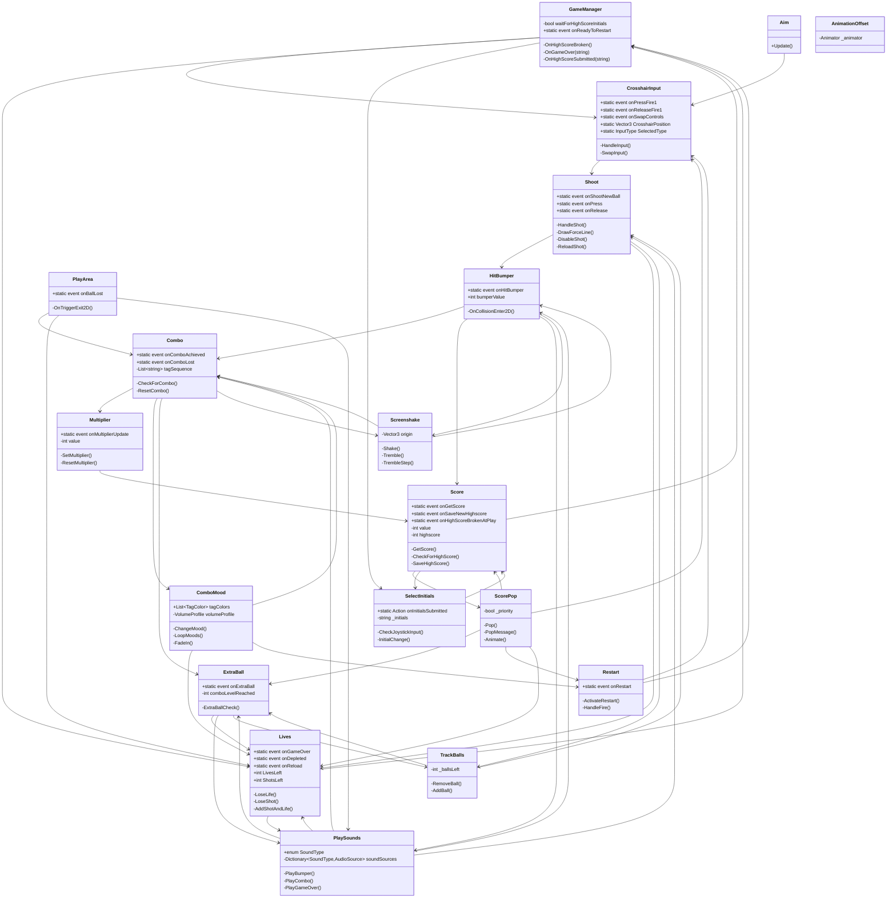
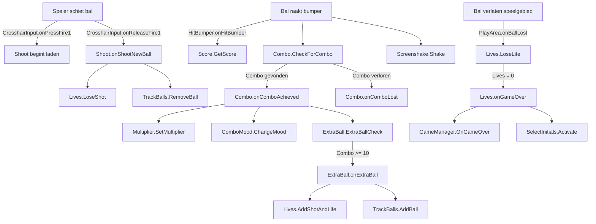

# Galactic Ricochet - Technische Documentatie

## Inhoudsopgave

1. [Projectoverzicht](#projectoverzicht)
2. [Architectuur](#architectuur)
3. [Class Diagram](#class-diagram)
4. [Action Events](#action-events)
5. [Componentenbeschrijvingen](#componentenbeschrijvingen-scripts)
6. [Dataflow](#dataflow)
7. [Event Communicatie Matrix](#event-communicatie-matrix)
8. [Configuratie & Aanpassingen](#configuratie--aanpassingen-via-unity)

---

## Projectoverzicht

**Galactic Ricochet** is een pinball-achtig arcade-spel gebouwd in Unity. Het spel concentreert zich op:

- **Scoring**: Spelers verdienen punten door ballen in bumpers te schieten
- **Multipliers**: Combo-systeem dat de score vermenigvuldigt
- **Lives Management**: Ballen volgen en verliezen levens
- **Input Handling**: Ondersteuning voor zowel muis als Xbox-controller input
- **Visuele/Audio Feedback**: Screenshakes, animaties en geluidsfeedback

Het kernmechanisme draait om een **event-driven architectuur** waarbij verschillende systemen via static events communiceren.

---

## Architectuur

### Architectuurprincipes

1. **Event-driven Architecture**: Alle communicatie tussen systemen verloopt via static `Action` events
2. **Separation of Concerns**: Elk script heeft één specifieke verantwoordelijkheid
3. **Decoupled Design**: Systemen zijn minimaal afhankelijk van elkaar
4. **Observer Pattern**: Scripts subscriben op relevante events en reageren hierop

### Lagenopbouw

```
┌─────────────────────────────────────┐
│   Feedback Layer                    │
│   (UI, Visuals, Sound)              │
├─────────────────────────────────────┤
│   Game Logic Layer                  │
│   (Scoring, Lives, Combos)          │
├─────────────────────────────────────┤
│   Interaction Layer                 │
│   (Bumpers, Ball Physics)           │
├─────────────────────────────────────┤
│   Input & Control Layer             │
│   (Crosshair, Aim, Shoot)          │
└─────────────────────────────────────┘
```

---

## Class Diagram



---

## Action Events

### Volledig Overzicht van Action Events en Argumenten

#### 1. **CrosshairInput Events** (Input Management)

| Event            | Type             | Argumenten                         | Beschrijving                                      |
| ---------------- | ---------------- | ---------------------------------- | ------------------------------------------------- |
| `onPressFire1`   | `Action`         | -                                  | Wordt geactiveerd wanneer Fire1 button ingedrukt  |
| `onReleaseFire1` | `Action`         | -                                  | Wordt geactiveerd wanneer Fire1 button losgelaten |
| `onSwapControls` | `Action<string>` | `message` (bv. "Mouse Activated!") | Signaleert input-type wissel d.m.v. TAB           |

**Subscribers:**

- `Shoot.HandlePressFire()`
- `Shoot.HandleReleaseFire()`
- `ScorePop.PopMessage()`
- `Restart.HandleFire()`

---

#### 2. **Shoot Events** (Bal Afvuren)

| Event            | Type                 | Argumenten                    | Beschrijving                         |
| ---------------- | -------------------- | ----------------------------- | ------------------------------------ |
| `onShootNewBall` | `Action<GameObject>` | `ball` (nieuw bal GameObject) | Bal is afgeschoten                   |
| `onPress`        | `Action`             | -                             | Trigger ingedrukt (laden begonnen)   |
| `onRelease`      | `Action`             | -                             | Trigger losgelaten (bal afgeschoten) |

**Subscribers:**

- `Lives.LoseShot()` - voor `onShootNewBall`
- `TrackBalls.RemoveBall()` - voor `onShootNewBall`
- `PlaySounds.PlayLoadup()` - voor `onPress`
- `PlaySounds.StopLoadup()` - voor `onRelease`

---

#### 3. **HitBumper Events** (Bumper Botsing)

| Event         | Type                     | Argumenten                                             | Beschrijving     |
| ------------- | ------------------------ | ------------------------------------------------------ | ---------------- |
| `onHitBumper` | `Action<Transform, int>` | `transform` (bumper transform), `bumperValue` (punten) | Bal raakt bumper |

**Subscribers:**

- `Combo.CheckForCombo()` - tagt bumper
- `Score.GetScore()` - voegt punten toe
- `PlaySounds.PlayBumper()` - speelt geluid
- `Screenshake.Shake()` - camera trilt

---

#### 4. **PlayArea Events** (Bal Verloren)

| Event        | Type     | Argumenten | Beschrijving            |
| ------------ | -------- | ---------- | ----------------------- |
| `onBallLost` | `Action` | -          | Bal verlaat speelgebied |

**Subscribers:**

- `Combo.ResetCombo()`
- `Lives.LoseLife()`
- `PlaySounds.PlayBallLost()`

---

#### 5. **Combo Events** (Combo Systeem)

| Event             | Type                  | Argumenten                                       | Beschrijving         |
| ----------------- | --------------------- | ------------------------------------------------ | -------------------- |
| `onComboAchieved` | `Action<int, string>` | `comboLevel` (huidige combo), `tag` (bumper tag) | Nieuwe combo bereikt |
| `onComboLost`     | `Action<int, string>` | `0`, `"None"`                                    | Combo onderbroken    |

**Subscribers:**

- `Multiplier.SetMultiplier()` - stelt vermenigvuldiger in
- `ComboMood.ChangeMood()` - wijzigt visuele stijl
- `ExtraBall.ExtraBallCheck()` - controleert extra leven trigger
- `Screenshake.Tremble()` - sterke camera-beving
- `PlaySounds.PlayCombo()` - combo geluid

---

#### 6. **Multiplier Events** (Score Vermenigvuldiging)

| Event                | Type          | Argumenten                        | Beschrijving                |
| -------------------- | ------------- | --------------------------------- | --------------------------- |
| `onMultiplierUpdate` | `Action<int>` | `value` (nieuwe vermenigvuldiger) | Multiplier waarde gewijzigd |

**Subscribers:**

- `Score.SetMultiplier()`

---

#### 7. **Lives Events** (Levens Beheer)

| Event        | Type             | Argumenten      | Beschrijving                          |
| ------------ | ---------------- | --------------- | ------------------------------------- |
| `onGameOver` | `Action<string>` | `"Game Over !"` | Spel eindigt                          |
| `onDepleted` | `Action`         | -               | Alle ballen opgebruikt                |
| `onReload`   | `Action`         | -               | Nieuw bal beschikbaar (na extra life) |

**Subscribers:**

- `GameManager.OnGameOver()`
- `PlaySounds.PlayGameOver()` - voor `onGameOver`
- `Shoot.DisableShot()` - voor `onDepleted`
- `Shoot.ReloadShot()` - voor `onReload`
- `ComboMood.LoopMoods()` - voor `onGameOver`

---

#### 8. **ExtraBall Events** (Extra Leven)

| Event         | Type             | Argumenten     | Beschrijving             |
| ------------- | ---------------- | -------------- | ------------------------ |
| `onExtraBall` | `Action<string>` | `"Extra Life"` | Extra bal/leven verdiend |

**Subscribers:**

- `Lives.AddShotAndLife()`
- `PlaySounds.PlayExtraBall()`
- `ScorePop.PopMessage()`
- `TrackBalls.AddBall()`

---

#### 9. **Score Events** (Scoring Systeem)

| Event                     | Type                   | Argumenten                                         | Beschrijving                    |
| ------------------------- | ---------------------- | -------------------------------------------------- | ------------------------------- |
| `onGetScore`              | `Action<Vector2, int>` | `location` (bumper positie), `addedScore` (punten) | Punten verdiend                 |
| `onSaveNewHighscore`      | `Action<int>`          | `highscore` (nieuwe highscore)                     | Nieuwe record                   |
| `onHighScoreBrokenAtPlay` | `Action`               | -                                                  | Huidige spel verslaat highscore |

**Subscribers:**

- `ScorePop.Pop()` - voor `onGetScore`
- `SelectInitials.Activate()` - voor `onSaveNewHighscore`
- `GameManager.OnHighScoreBroken()` - voor `onHighScoreBrokenAtPlay`

---

#### 10. **GameManager Events** (Game Controle)

| Event              | Type     | Argumenten | Beschrijving        |
| ------------------ | -------- | ---------- | ------------------- |
| `onReadyToRestart` | `Action` | -          | Spel kan herstarten |

**Subscribers:**

- `Restart.ActivateRestart()`
- `ComboMood.StopMoodLoop()`

---

#### 11. **Restart Events** (Herstart UI)

| Event       | Type             | Argumenten | Beschrijving         |
| ----------- | ---------------- | ---------- | -------------------- |
| `onRestart` | `Action<string>` | `"GO!"`    | Herstart geactiveerd |

**Subscribers:**

- `ScorePop.PopMessage()`
- `ComboMood.ChangeMood()`

---

#### 12. **SelectInitials Events** (Initialen Invoer)

| Event                 | Type             | Argumenten              | Beschrijving        |
| --------------------- | ---------------- | ----------------------- | ------------------- |
| `onInitialsSubmitted` | `Action<string>` | `_initials` (bv. "AAA") | Initialen ingevoerd |

**Subscribers:**

- `Score.SaveHighScore()`
- `GameManager.OnHighScoreSubmitted()`

---

### Event-Flow Diagram



---

## Componentenbeschrijvingen (Scripts)

### Input & Control Layer

#### **CrosshairInput**

- **Functie**: Beheert speelersbesturing (muis of Xbox-controller)
- **Key Properties**:
  - `CrosshairPosition` (static) - wereldpositie van de "Crosshair"
  - `SelectedType` (static) - actieve input type
- **Key Methods**:
  - `HandleInput()` - verwerkt muis/joystick input
  - `SwapInput()` - wissel input-type op triple-tap Tab
- **Events**: `onPressFire1`, `onReleaseFire1`, `onSwapControls`

#### **Aim**

- **Functie**: Roteert pijl/kanon naar crosshair positie
- **Logica**: Berekent hoek tussen pijl en crosshair middels `Atan2`

#### **Shoot**

- **Functie**: Beheert ballen-afvuur mechanisme
- **Features**:
  - Drukken = laden (timer)
  - Loslaten = schieten met berekende kracht
  - Visuele feedback: LineRenderer toont lading
  - Particle effect tijdens laden
- **Key Properties**:
  - `forcePerSecond` - kracht per seconde houden
  - `maximumHoldSeconds` - maximale laadtijd
- **Key Methods**:
  - `HandleShot()` - verwerkt drukken/loslaten
  - `DrawForceLine()` - visualiseert launch-force


---

### Interaction Layer

#### **HitBumper**

- **Functie**: Registreert botsing met bumpers
- **Logica**:
  - OnCollisionEnter2D checkt op "Ball" tag
  - Triggeert `onHitBumper` event met bumper waarde
  - Particlesysteem activeren
- **Key Properties**: `bumperValue` - punten per hit

#### **PlayArea**

- **Functie**: Detecteert wanneer bal speelgebied verlaat
- **Logica**: OnTriggerExit2D vernietigert bal en triggeert `onBallLost`


---

### Game Logic Layer

#### **Lives**

- **Functie**: Beheert levens/ballen van speler
- **Logica**:
  - Ball Lost → verlies een leven
  - Shoot New Ball → haal bal uit de reserve
  - Extra Ball → extra leven/schot
  - Lives ≤ 0 → Game Over
- **Key Properties**:
  - `lives` - huidige levens
  - `shotsLeft` - beschikbare ballen
- **Public Properties**:
  - `LivesLeft` (getter)
  - `ShotsLeft` (getter)

#### **Combo**

- **Functie**: Detecteert combo's via bumper tags
- **Logica**:
  - Bijhouden `tagSequence` lijst
  - Dezelfde tag 2x = combo niveau 2
  - Verschillende tag = reset
- **Events**: `onComboAchieved`, `onComboLost`

#### **Multiplier**

- **Functie**: Beheert score-multiplier gebaseerd op combo
- **Logica**: Multiplier = combo level (1x tot ∞x)

#### **Score**

- **Functie**: Beheert totale score en highscore
- **Logica**:
  - Score = baseScore × multiplier
  - Highscore in PlayerPrefs opgeslagen
  - Breekt highscore → wacht op initialen
- **Key Properties**:
  - `value` - huidige score
  - `highscore` - opgeslagen record
  - `scoreMultiplier` - huidig vermenigvuldiger

#### **ExtraBall**

- **Functie**: Verleent extra leven bij specifieke combo
- **Trigger**: Combo level ≥ `comboLevelReached` (default: 20)

---

### Feedback Layer

#### **PlaySounds**

- **Functie**: Speelt geluidseffecten af
- **SoundType Enum**:
  - `Bumper` - bumper hit geluid
  - `Combo` - combo bereikt geluid (pitch varieert met level)
  - `GameOver` - einde spel geluid
  - `ExtraBall` - extra leven geluid
  - `BallLost` - bal verloren geluid
  - `Loadup` - schoten laden geluid (loopend)
- **Logica**: 6 AudioSource componenten gekoppeld aan de enum

#### **Screenshake**

- **Functie**: Trilt camera
- **Twee intensiteiten**:
  - `Shake()` - kort, sterk (bumper hit)
  - `Tremble()` - lang, variabel (combo - sterker bij hoger level)
- **Logica**: Coroutine voegt random offset toe aan camera positie

#### **ScorePop**

- **Functie**: Toont floating tekst feedback
- **Twee typen**:
  - Score popup (klein, op bumper locatie)
  - Berichten popup (groot, centraal - "Extra Life", "Game Over", etc.)
- **Logic**: Animatie met schaal van 1 tot 4-8x over tijd

#### **ComboMood**

- **Functie**: Wijzigt visuele stijl op basis van combo
- **Features**:
  - TagColor mapping (bumper tag → kleur)
  - Vignette effect gebaseerd op kleur
  - Text field kleuring aanpassingen
  - Game Over loop: loopt door alle kleuren
- **Key Properties**:
  - `tagColors` - lijst van tag → Color mappings
  - `fadeIntensity`, `fadeToColorTime`, `fadeToBlackTime` - timing

---

### Management Layer

#### **GameManager**

- **Functie**: Regelt de game-flow
- **Logica**:
  - Detecteert highscore verbreking
  - Wacht op initialen input als nodig
  - Schakelt Crosshair/Aim uit/in
  - Triggeert herstart
- **Events**: `onReadyToRestart`

#### **Restart**

- **Functie**: Beheert restart UI
- **Logica**:
  - Toont "PRESS FIRE TO RESTART" tekst
  - Fire press → herlaad scene
  - Onderkent initialen submit

#### **SelectInitials**

- **Functie**: Input voor highscore houder initialen
- **Features**:
  - Xbox Controller: Joystick verplaatsing between A-Z
  - Muis: Klikt UI knoppen
  - Countdown timer (5 sec) naar auto-submit
- **Key Properties**:
  - `_initials` - 3-character string
  - `_initialIndex` - huidge geselecteerde positie

#### **TrackBalls**

- **Functie**: UI display voor beschikbare ballen
- **Logica**: Synchroniseert `_ballsLeft` met Lives.ShotsLeft

#### **AnimationOffset**

- **Functie**: Randomiseert animator state voor de bumpers
- **Logica**: Random speed (0.7-1.3x) + start-offset voor bumpers

---

## Dataflow

### Simpel Scenario: Speler schiet bal in bumper

```
1. Speler klikt muis
   └─> CrosshairInput.HandleInput()
       └─> CrosshairInput.onPressFire1.Invoke()
           ├─> Shoot.HandlePressFire()
           └─> PlaySounds.PlayLoadup()

2. Speler houdt vast (0.5s)
   └─> Shoot._pressTimer accumuleert

3. Speler laat los
   └─> CrosshairInput.HandleInput()
       └─> CrosshairInput.onReleaseFire1.Invoke()
           ├─> Shoot.HandleReleaseFire()
           │   └─> Shoot.onShootNewBall.Invoke(ball)
           │       ├─> Lives.LoseShot()
           │       └─> TrackBalls.RemoveBall()
           └─> PlaySounds.StopLoadup()

4. Bal vliegt naar bumper
   └─> HitBumper.OnCollisionEnter2D(Ball)
       └─> HitBumper.onHitBumper.Invoke(bumper, 50)
           ├─> Score.GetScore()
           │   ├─> score += 50 × multiplier
           │   ├─> Score.onGetScore.Invoke(location, addedScore)
           │   │   └─> ScorePop.Pop(location, addedScore)
           │   └─> Als score > highscore:
           │       └─> Score.onHighScoreBrokenAtPlay.Invoke()
           ├─> Combo.CheckForCombo()
           │   └─> tagSequence toevoegen
           ├─> PlaySounds.PlayBumper()
           └─> Screenshake.Shake()

5. Combo check: bumper raakt weer dezelfde tag
   └─> Combo.onComboAchieved.Invoke(comboLevel, tag)
       ├─> Multiplier.SetMultiplier(comboLevel)
       │   └─> Multiplier.onMultiplierUpdate.Invoke(comboLevel)
       ├─> ComboMood.ChangeMood(comboLevel, tag)
       ├─> ExtraBall.ExtraBallCheck(comboLevel)
       │   └─> Als comboLevel == 20:
       │       └─> ExtraBall.onExtraBall.Invoke("Extra Life")
       │           ├─> Lives.AddShotAndLife()
       │           ├─> PlaySounds.PlayExtraBall()
       │           ├─> ScorePop.PopMessage("Extra Life")
       │           └─> TrackBalls.AddBall()
       └─> Screenshake.Tremble(comboLevel)
```

### Complex Scenario: Game Over & Highscore

```
1. Speler verliest laatste bal
   └─> PlayArea.OnTriggerExit2D(Ball)
       └─> PlayArea.onBallLost.Invoke()
           ├─> Lives.LoseLife()
           │   └─> Als lives == 0:
           │       └─> Lives.onGameOver.Invoke("Game Over !")
           ├─> Combo.ResetCombo()
           └─> PlaySounds.PlayBallLost()

2. Lives.onGameOver triggert
   ├─> GameManager.OnGameOver()
   │   └─> Als waitForHighScoreInitials:
   │       ├─> CrosshairInput.enabled = false
   │       └─> Aim.enabled = false
   ├─> PlaySounds.PlayGameOver()
   └─> ComboMood.LoopMoods()
       └─> Animeer door alle combo colors

3. Score check
   └─> Score.CheckForHighScore()
       └─> Als value > highscore:
           └─> Score.onSaveNewHighscore.Invoke(highscore)
               └─> SelectInitials.Activate()
                   ├─> Toont UI
                   └─> Wacht op invoer

4. Speler voert initialen in
   └─> SelectInitials.OnPressDone()
       └─> SelectInitials.onInitialsSubmitted.Invoke("AAA")
           ├─> Score.SaveHighScore("AAA")
           │   └─> PlayerPrefs.SetInt("highscore", value)
           │   └─> PlayerPrefs.SetString("holder", "AAA")
           └─> GameManager.OnHighScoreSubmitted()
               ├─> CrosshairInput.enabled = true
               ├─> Aim.enabled = true
               └─> GameManager.onReadyToRestart.Invoke()
                   └─> Restart.ActivateRestart()
                       └─> Toont "PRESS FIRE TO RESTART"

5. Speler drukt Fire
   └─> CrosshairInput.onPressFire1.Invoke()
       └─> Restart.HandleFire()
           └─> SceneManager.LoadScene() → HERSTART SPEL
```

---

## Event Communicatie Matrix

| Bron               | Event                   | Target(s)                                                 | Parameter(s)   |
| ------------------ | ----------------------- | --------------------------------------------------------- | -------------- |
| **CrosshairInput** | onPressFire1            | Shoot, Restart                                            | -              |
|                    | onReleaseFire1          | Shoot                                                     | -              |
|                    | onSwapControls          | ScorePop                                                  | string         |
| **Shoot**          | onShootNewBall          | Lives, TrackBalls                                         | GameObject     |
|                    | onPress                 | PlaySounds                                                | -              |
|                    | onRelease               | PlaySounds                                                | -              |
| **HitBumper**      | onHitBumper             | Combo, Score, PlaySounds, Screenshake                     | Transform, int |
| **PlayArea**       | onBallLost              | Combo, Lives, PlaySounds                                  | -              |
| **Combo**          | onComboAchieved         | Multiplier, ComboMood, ExtraBall, Screenshake, PlaySounds | int, string    |
|                    | onComboLost             | Multiplier, ComboMood                                     | int, string    |
| **Multiplier**     | onMultiplierUpdate      | Score                                                     | int            |
| **Lives**          | onGameOver              | GameManager, PlaySounds, ComboMood                        | string         |
|                    | onDepleted              | Shoot                                                     | -              |
|                    | onReload                | Shoot                                                     | -              |
| **Score**          | onGetScore              | ScorePop                                                  | Vector2, int   |
|                    | onSaveNewHighscore      | SelectInitials                                            | int            |
|                    | onHighScoreBrokenAtPlay | GameManager                                               | -              |
| **ExtraBall**      | onExtraBall             | Lives, PlaySounds, ScorePop, TrackBalls                   | string         |
| **GameManager**    | onReadyToRestart        | Restart, ComboMood                                        | -              |
| **Restart**        | onRestart               | ScorePop, ComboMood                                       | string         |
| **SelectInitials** | onInitialsSubmitted     | Score, GameManager                                        | string         |

---

## Kwaliteitskenmerken

### Voordelen van het Huidige Design

**Event-driven Decoupling**: Systemen kunnen onafhankelijk worden gewijzigd  
**Extensibility**: Nieuwe features toevoegen zonder bestaande code aan te raken  
**Reusability**: PlaySounds kan elk event type afhandelen  
**Testability**: Elk systeem kan in isolatie worden getest  
**Maintainability**: Duidelijke flow via event subscription

### Potentiële Risico's

**Memory Leaks**: Action Event moeten altijd in OnDisable "unsubscribed" worden om memmory leaks en bugs te voorkomen!
**Performance**: Bij vele events kan overhead toenemen. Dus deze moeten zoveel mogelijk worden hergebruikt. Niemand mag zonder overleg met de lead developer zomaar nieuwe events toevoegen. Nieuwe events moeten ook worden geupdate in deze documentatie.

---

## Configuratie & Aanpassingen via Unity

### Bumper Value Aanpassen

- Edit in Inspector: `HitBumper.bumperValue` (default: 50)

### Combo Trigger voor Extra leven

- Edit in Inspector: `ExtraBall.comboLevelReached` (default: 20)

### Controls van het Initialen Menu

- Edit in Inspector: `SelectInitials.submissionDelay` of `SelectInitials.inputThreshold` voor het tweaken van de controls

### Audio

- Edit in Inspector: AudioSource componenten onder PlaySounds

Elke nieuwe audiosample moet worden toegevoegd aan de Enum `PlaySounds.SoundType`

In `PlaySounds` moet er een handler worden gemaakt voor het afspelen van het nieuwe geluid.

Deze geluiden worden getriggerd door Action Events.

### Visuele Effects

- ComboMood: `fadeIntensity`, `fadeToColorTime`, `fadeToBlackTime`, `loopInterval` aanpassen in de inspector om de timing van de visuele effecten te tweaken.
- Screenshake: `shakeTime`, `shakeForce` per event type (`Shake`&`Tremble`) moet in de code aangepast worden om de screenshake timing te tweaken.

---
